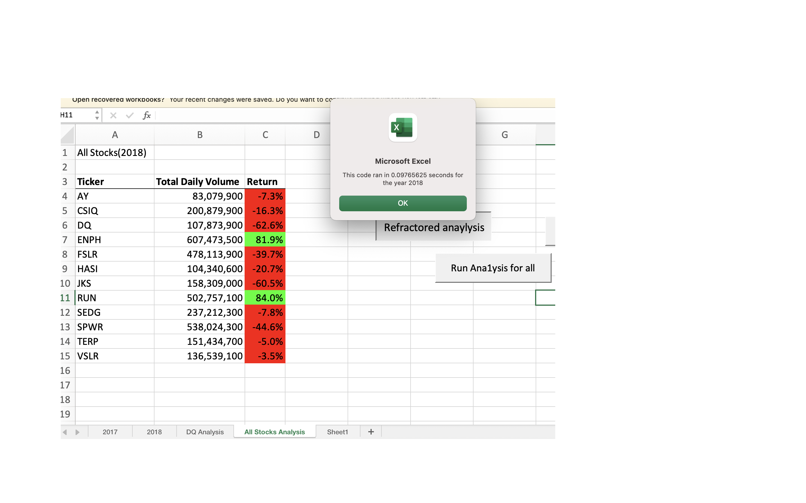

# **Stock-Analysis**
## Overview

Performing analysis by using VBA to perform financial analysis on [green_stocks](green_stocks.xlsm) data to help Steve's parents to decide whether they should invest all the money in DQ stocks or not.  We are going to compare the green energy stock data in 2017 and in 2018  by using macro in excel.

## Results

### -2017 vs. 2018 in stock performance
To analyze the performance of 2017 and 2018, first use conditional statement in for loop to filter the starting and ending prices of current ticker(DQ) by using the code below in excel macro.
       

    For i = 2 To RowCount
    
        'Increase volume for current ticker
        tickerVolumes(tickerIndex) = tickerVolumes(tickerIndex) + Cells(i, 8).Value
        
        'Find starting price for current ticker
        If Cells(i - 1, 1).Value <> tickers(tickerIndex) Then
            tickerStartingPrices(tickerIndex) = Cells(i, 6).Value
        End If
        
        'Find ending price for current ticker
        If Cells(i + 1, 1).Value <> tickers(tickerIndex) Then
            tickerEndingPrices(tickerIndex) = Cells(i, 6).Value
            tickerIndex = tickerIndex + 1
        End If 
    Next i
    
Then, use for for loop to find the outcome of DQ in percentage by using code below.

      For i = 0 To 11
        Worksheets("All Stocks Analysis").Activate
        Cells(4 + i, 1).Value = tickers(i)
        Cells(4 + i, 2).Value = tickerVolumes(i)
        Cells(4 + i, 3).Value = tickerEndingPrices(i) / tickerStartingPrices(i) - 1
      Next i
      Range("B4:B15").NumberFormat = "#,##0"
      Range("C4:C15").NumberFormat = "0.0%"
      
DQ stock was showing an increase of 199.4% in 2017 return and a decrease by -62.6% in 2018 return. Also, the total daily volume in 2017 was 35,796,200 and in 2018 was 107,873,900, which shows the volume has been increased as shown in the pictures below.

- All Stocks(2017)

- All Stocks(2018)

### - Orginal script vs. Refactored script in execution times
To compare the execution times, we used the code below to show in msgbox.

        startTime = Timer
        endTime = Timer
    MsgBox "This code ran in " & (endTime - startTime) & " seconds for the year " & (yearValue)
    
As shown in the pictures below, the original script of 2017 took 0.320 seconds and refactored script of 2017 took 0.096seconds to execute the process.

- Original in 2017

- Refactored in 2017

Also, the original script of 2018 took 0.320 seconds, and refactored script of 2018 took 0.098seconds to execute the process as shown in the pictures below.

- Original in 2018

- Refactored in 2018

Both refactored codes of 2017 and 2018 took shorter time than original codes of 2017 and 2018.

## Summary
In the analysis above from 2017 to 2018, we can see that DQ has a combination of both a sharp drop in price and a spike in trading volume. This indicates that the uptrend which showed in the 2017 return rate has been ended. So, this is not a good time to invest DQ with all Steve's parents' money.
Also, when we analyzing the trends with code, we have executed both the original script and refactored script. Apparentlly, the refactored script takes a shorter time compared to the original script especially when we have a humongous volume of data in VBA script. Refactored code will give outcomes efficiently in time compared to the original. However, to refine and make a concise code takes time to organize in a clean way. Sometimes, figuring out the refactored code itself will make us get lost on the way out.

